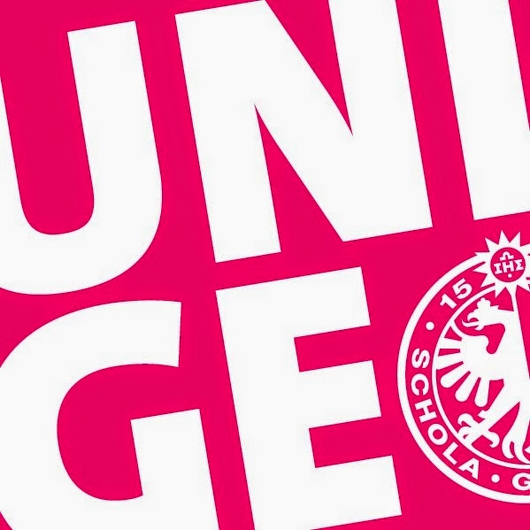
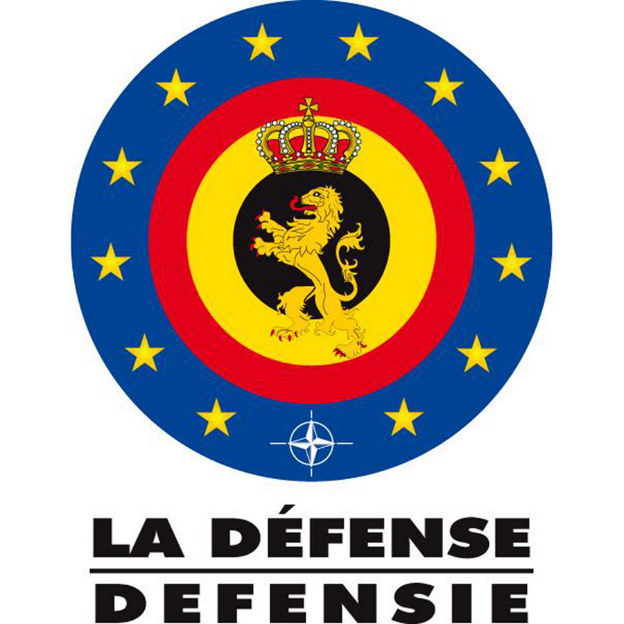
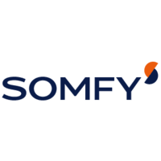
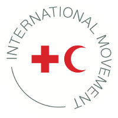

---
# Feel free to add content and custom Front Matter to this file.
# To modify the layout, see https://jekyllrb.com/docs/themes/#overriding-theme-defaults
layout: home
title: Resume - EN
---

My resume: [resume.pdf](/assets/res/resume/resume.pdf)

## Education

2014 - 2017 Bachelor's Degree in Information Systems - **University of Geneva**  
Main subjects: Network, Software engineering, Information systems

Title of the Thesis: _Technical analysis of applicative and Web vulnerabilities
via PDF files_  
Supervisor: Prof. Dimitri Konstantas, UniGE

2017 - 2020 - Master's degree in Cybersecurity - **Free University of Brussels**  
Main subjects: Information security, Network security, Secure software
development    
Inter-school program: Free University of Brussels, University of Namur,
Catholic University of Louvain, Royal Military Academy, HE2B, HELB  

Title of the Thesis: Attacking mobile browsers with extensions   
Supervisor: Prof. Ramin Sadre, UCL

## Experience

Feb. - May 2020 - Student intern - **Belgian Defence**  
Radio-controlled drones pentesting with SDR
Exploit development (contribution to Dronesploit framework)

Jul. 2019 -  IT security technician - **Somfy Group**  
Active Directory security  
Security best practices drafting  
Security awareness  
**Interim contract**  

Jul. 2018 - IT security technician - **Somfy Group**  
Linux & Windows servers hardening  
Security best practices drafting  
Logs management  
Risk and dysfunctions analysis  
**Interim contract**

2015 - now - **Genevan Red Cross**  
Volunteer at Genevan Red Cross since 2015
y
## Skills

- **Software reverse engineering**  
Windows (PE, .Net), GNU/Linux, ARM, Android, malware analysis  
- **Programming**  
Python (daily use), Java, Javascript, PHP, Bash, Powershell  
- **Bug hunting and code review**
- **Web security**  
common web attacks and defence measures (client and server side), browser extensions security

## Misc

- 2019 -  Member of the Swiss CTF team 0FA  
- 2019 - **European Cyber Week**  
6th place at the ECW CTF Finals   
Rennes, France  
- 2019 - **Cybersecurity Challenge Belgium**  
7th place at the CSC Belgium 2019  
10 th place at the qualifiers  
team ~#sudo maso  
Brussels, Belgium  
- 2018 - **Cybersecurity Challenge Belgium**  
14 th place at the CSC Belgium 2018  
team JM team  
Brussels, Belgium  
- 2018 - **Brucon - Cronos CTF**  
4 th place at the Cronos CTF  
Brucon 0x0A (solo CTF)  
Ghent, Belgium
